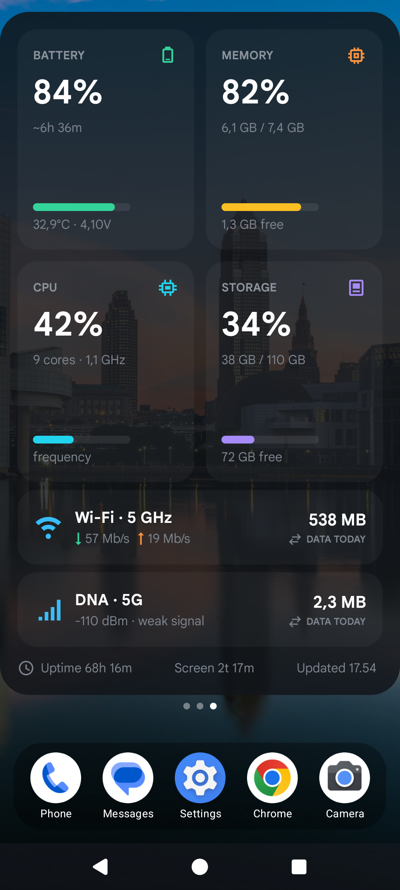
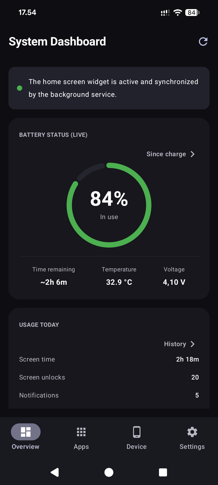
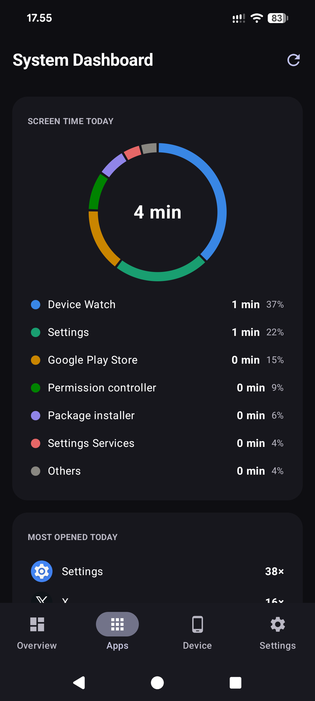
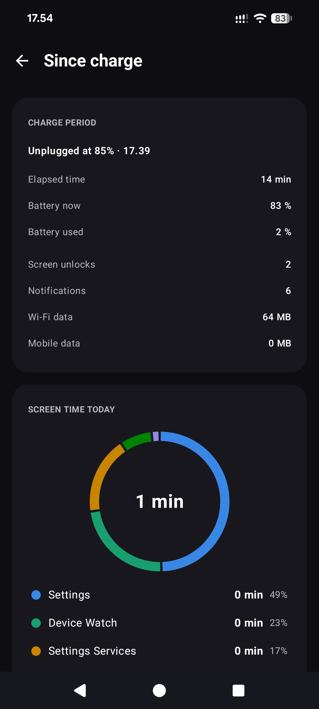
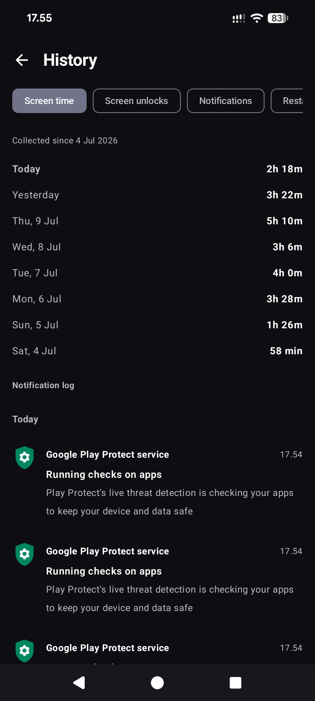
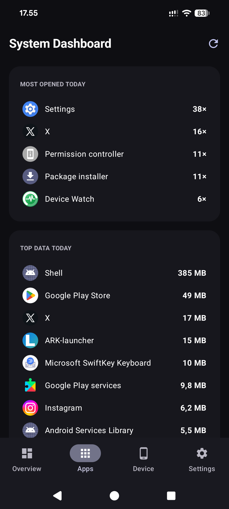
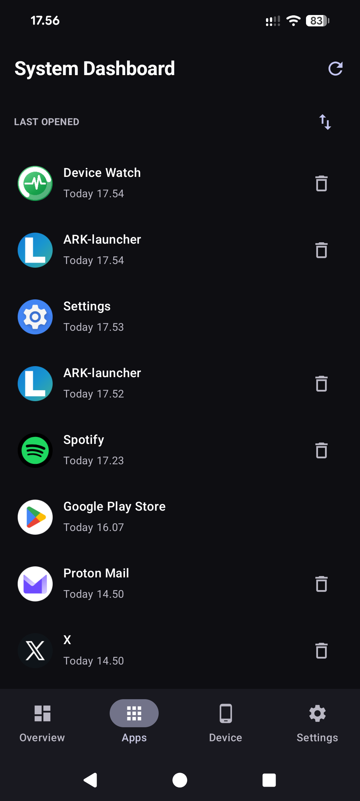
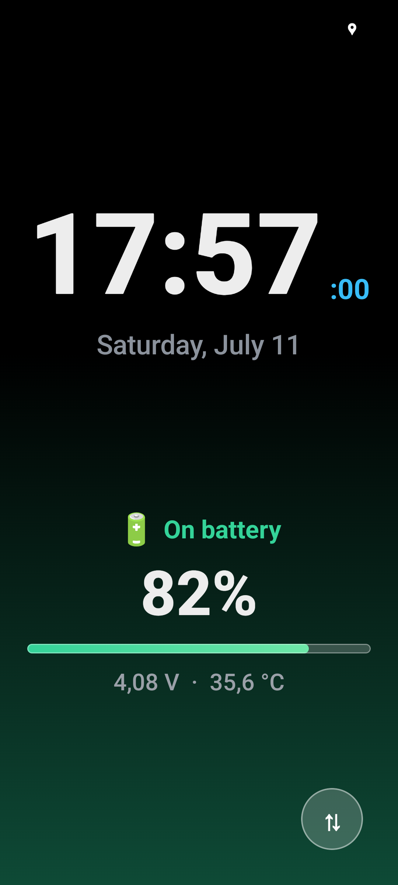

# Device Watch

[](https://github.com/jrs8205/Device-Watch/releases/latest)
[](https://github.com/jrs8205/Device-Watch/releases)
[](https://developer.android.com/jetpack/compose)
[](LICENSE)

Device Watch is an Android device monitoring app with a Jetpack Glance home screen widget, per-app usage insights (screen time, data, notifications and more), and an interactive screensaver for charging or docked use.

The default app language is English. Finnish users get a localized app name and UI through Android's `values-fi` resources.

## Screenshots

<p>
  
  
  
  
</p>
<p>
  
  
  
  
</p>

## Features

- Home screen widget for battery, memory, CPU, storage, Wi-Fi, mobile network, data usage, uptime, today's screen time, and last update time
- Tapping the widget anywhere opens the app
- Data counters per calendar day or per one-month billing cycle with a configurable start day (month lengths handled automatically); the selection applies to the widget and the in-app data rows
- Tabbed dashboard UI: Overview (live battery ring, usage counters, RAM/CPU/storage meters and data counters — full widget parity for people who skip the widget), Apps (usage insights), Device (hardware, SIM and Wi-Fi details), and Settings
- Apps tab: Digital-Wellbeing-style screen-time donut (top apps + others) with tappable legend, top data consumers today, and a last-opened list (oldest and never-used apps first, reversible) with per-app uninstall; home-screen launchers excluded from usage rankings
- Per-app detail sheet: screen time, times opened, last opened, data used and notifications today
- Usage counters on the Overview tab, scoped to the same day/billing-cycle setting as the data counters: total screen time, screen unlocks (API 28+), a filtered notification count (ongoing notifications, group summaries and updates to an existing notification are not counted, so the number stays believable), device restarts and charging sessions
- The app keeps its own 62-day daily history for these counters (Android has no retroactive API): unlocks and screen time are backfilled from the ~7 days Android remembers, restarts are derived from BOOT_COUNT deltas (immune to Android re-delivering BOOT_COMPLETED after app updates), and notification/charging tallies accumulate from install onward
- On-device notification log with app name, timestamp, title, and text; 7-day retention; tapping an entry opens the app that posted it (when still installed)
- History page (opened from the usage card) listing exact daily values for the retained 62 days — screen time, unlocks, notifications, device restarts, and charging sessions; each metric states since when it has been collected, and the page refreshes itself while open
- Since-charge page (opened from the battery card): the period since the battery was last charged full — or since the charger was unplugged, when charging stopped short of full — with elapsed time, battery drop and average drain, unlocks, notifications, Wi-Fi/mobile data, and a per-app screen-time donut over that window (Android does not expose real per-app battery percentages to third-party apps, so the page shows honest usage numbers instead)
- Today's screen time also appears in the widget footer, refreshed at most once a minute so the 5-second widget loop stays untouched
- Most-opened-today list on the Apps tab, and last-opened rows show the clock time for apps used today (following the system 12/24-hour setting) with two-tier staleness colors: amber after 1 month unused, red after 3 months (Google's app-hibernation threshold) or never used
- Special-access buttons show a green/red status dot for granted/missing access
- Privacy dashboard shortcut for per-app location/microphone/camera usage (system view; that data is not exposed to third-party apps)
- Interactive Android screensaver with a large clock, date, next alarm, charging status, battery percentage, voltage, temperature, and live charging power in watts
- Screensaver clock follows the device 12/24-hour setting, with a second-aligned tick
- Battery-level-tinted background gradient and a softly pulsing charge indicator in the screensaver
- Optional screensaver dimming: manual, or automatic on a configurable night schedule (default 22:00–07:00)
- Remembered screensaver rotation setting for repeated charging sessions; the background gradient mirrors with the 180° layout swap
- Larger screensaver rotation touch target for easier use
- Battery full notification while the screensaver is active
- English default resources with Finnish localization
- Runtime permission handling for location, phone state, nearby Wi-Fi devices, and notifications
- Usage Access shortcut for network and app-usage statistics
- Release build configured with R8 minification and resource shrinking

Every metric is real data read from Android and kernel sources. When a value is not available with the permissions granted, the UI shows a dash (`—`) instead of a fabricated value.

## Download

Download the latest signed APK from the
[**Releases**](https://github.com/jrs8205/Device-Watch/releases/latest) page and open it on your
device to install. Because every release is signed with the same key, later versions install
cleanly as an update over an existing one.

> **Upgrading from v1.3.1 or older:** the application ID changed in v1.4.0 from
> `com.example.modernwidget` to `org.jarsi.devicewatch`, so Android treats it as a new app.
> Install the new version, re-grant its permissions, re-add the widget and re-select the
> screensaver, then uninstall the old one. Collected usage history starts fresh.

Requires **Android 8.0 (API 26)** or newer.

## Architecture

The app follows an MVVM + repository structure with Hilt dependency injection.

```
presentation/   DashboardViewModel, AppsViewModel, HistoryViewModel and
                SinceChargeViewModel (StateFlow UI state)
presentation/ui Compose-only screen code: SystemDashboardScreen scaffold with a
                Material 3 NavigationBar, Overview/Apps/Device/Settings tabs and
                shared components (SettingsSectionCard, DeviceInfoRow, AppIcon,
                ScreenTimeDonut, AppDetailSheet)
data/           SystemStatsRepository + AppUsageRepository (per-app usage, on demand)
                AppSettingsRepository (data-counter mode, cycle start day, sort order)
                NotificationStats + UsageHistory (own daily tallies, 62-day retention)
                SystemStatsParser, DataPeriodCalculator, UsageEventAggregator,
                NotificationCounting (pure, unit-tested calculations)
                SystemStats / AppUsage models (+ UNAVAILABLE_* sentinels)
widget/         Glance DashboardWidget, WidgetStateUpdater (DataStore writes),
                WidgetController (port the ViewModel talks to), receiver and actions
system/         SystemMonitorService (foreground), MonitorDreamService (screensaver),
                NotificationCounterService (notification listener)
di/             Hilt modules and entry points
```

- `SystemStatsRepositoryImpl` is the single source of truth. It is a `@Singleton`, reads system/kernel sources off the main thread on an injected dispatcher, and serializes its CPU-load snapshots with a `Mutex`.
- `SystemDashboardScreen` observes the ViewModels with `collectAsStateWithLifecycle()` and obtains them via `hiltViewModel()`. The four tabs are flat destinations switched with saveable tab state (no navigation library); each tab keeps its own scroll position. Permission requests and the foreground-service start stay at screen level.
- Services and the widget receiver use `@AndroidEntryPoint`; the Glance `ActionCallback` reaches the graph through a Hilt `EntryPoint`.

## Tech Stack

- Kotlin 2.4, AGP 9.2.1, Gradle 9.6
- `compileSdk 36`, `minSdk 26`, `targetSdk 35`
- Jetpack Compose (BOM 2026.06.00) + Material 3, Jetpack Glance 1.1.1
- Hilt 2.60 with KSP 2.3.9
- AndroidX Lifecycle 2.10, Activity 1.13, DataStore 1.2, WorkManager 2.11
- Dependencies are managed through the `gradle/libs.versions.toml` version catalog

## Language Behavior

Android selects the UI language from resource qualifiers:

- English and every non-Finnish device language use `app/src/main/res/values/strings.xml`
- Finnish devices use `app/src/main/res/values-fi/strings.xml`

## Permissions

The app requests only permissions that are used by the current feature set:

- `RECEIVE_BOOT_COMPLETED`
- `FOREGROUND_SERVICE`
- `FOREGROUND_SERVICE_SPECIAL_USE`
- `POST_NOTIFICATIONS`
- `ACCESS_NETWORK_STATE`
- `ACCESS_WIFI_STATE`
- `ACCESS_COARSE_LOCATION`
- `ACCESS_FINE_LOCATION`
- `NEARBY_WIFI_DEVICES`
- `READ_PHONE_STATE`
- `PACKAGE_USAGE_STATS`
- `QUERY_ALL_PACKAGES` (resolve names/icons for the per-app data list; the app is distributed outside Google Play)
- `REQUEST_DELETE_PACKAGES` (uninstall from the last-opened list via the system dialog)

Notification counting additionally uses the optional Notification access special permission (a `NotificationListenerService`); counting starts when access is granted. Do Not Disturb and Bluetooth control permissions are not requested.

## Building

Use the Gradle wrapper from the repository root:

```powershell
.\gradlew.bat :app:compileDebugKotlin
.\gradlew.bat :app:testDebugUnitTest
.\gradlew.bat :app:lintDebug
.\gradlew.bat :app:assembleDebug
.\gradlew.bat :app:assembleRelease
```

Release builds are minified with R8 and resource shrinking. The release APK is unsigned unless a local `keystore.properties` and keystore are present.

## Testing

JVM unit tests cover the pure parsing/maths and the ViewModel:

```powershell
.\gradlew.bat :app:testDebugUnitTest
```

- `SystemStatsParserTest` — CPU-load deltas, frequency residency/pressure, battery wear, mobile-generation mapping, Wi-Fi SSID/band, signal filtering
- `DataPeriodCalculatorTest` — billing-cycle period math (start-day clamping across month lengths, leap February, year rollover)
- `UsageEventAggregatorTest` — foreground-session folding (in-app activity switches, unclosed sessions), donut segments, last-use sorting, day math, staleness tiers and launch-count ranking
- `NotificationCountingTest` — the "real notification" filter and count retention/purging
- `UsageHistoryLogicTest` — BOOT_COUNT delta dedup and history-key retention
- `WidgetFormattingTest` — widget display formatters (locale-pinned), adaptive MB/GB data amounts
- `ChargeAnchorLogicTest` — the since-charge anchor state machine (full-charge vs unplug anchors, reboot persistence)
- `NotificationLogCodecTest` / `NotificationLogImplTest` — notification-log line escaping, retention and ordering
- `HistoryListLogicTest` — per-metric history trimming and "collected since" labels
- `SinceChargeNoticesTest` — visibility of the usage-access and stale-period notices
- `DashboardViewModelTest` — refresh, opacity load/commit, data-counter settings, daily counters, widget-installed flag (hand-written fakes)
- `AppsViewModelTest` — Apps-tab loading, empty state without usage access, detail assembly, sort toggle persistence
- `HistoryViewModelTest` — history-page loading and silent refresh
- `SinceChargeViewModelTest` — since-charge window queries, empty state, non-overlapping refreshes
- `ClockFitTest` — screensaver clock width-fit math
- `DreamLogicTest` — night-dim window (incl. crossing midnight) and charging-wattage normalization

## Build Outputs

```text
app/build/outputs/apk/debug/app-debug.apk
app/build/outputs/apk/release/app-release.apk
```

APK and signing files are intentionally ignored by Git.

## Project Structure

```text
app/src/main/java/org/jarsi/devicewatch/
  MainActivity.kt
  MonitorApp.kt
  data/
    AppSettingsRepository.kt
    AppSettingsRepositoryImpl.kt
    AppUsage.kt
    AppUsageRepository.kt
    AppUsageRepositoryImpl.kt
    BatteryStatusReader.kt
    ChargeAnchor.kt
    ChargeAnchorStoreImpl.kt
    DataPeriod.kt
    NotificationCounting.kt
    NotificationLog.kt
    NotificationLogImpl.kt
    NotificationStats.kt
    NotificationStatsImpl.kt
    SystemStats.kt
    SystemStatsParser.kt
    SystemStatsRepository.kt
    SystemStatsRepositoryImpl.kt
    UsageEventAggregator.kt
    UsageHistory.kt
    UsageHistoryImpl.kt
  di/
    DispatchersModule.kt
    RepositoryModule.kt
    RepositoryEntryPoint.kt
  presentation/
    AppsViewModel.kt
    DashboardViewModel.kt
    HistoryViewModel.kt
    SinceChargeViewModel.kt
    ui/
      AppDetailSheet.kt
      AppsTab.kt
      DashboardComponents.kt
      DashboardTabs.kt
      DeviceTab.kt
      HistoryListLogic.kt
      HistoryPage.kt
      OverviewTab.kt
      ScreenTimeDonut.kt
      SettingsTab.kt
      SinceChargeNotices.kt
      SinceChargePage.kt
  system/
    BatteryFullNotifier.kt
    DreamPreferences.kt
    MonitorDreamService.kt
    NotificationCounterService.kt
    SystemMonitorService.kt
  widget/
    DashboardWidget.kt
    DashboardWidgetReceiver.kt
    RefreshStatsAction.kt
    WidgetController.kt
    WidgetStateUpdater.kt

app/src/test/java/org/jarsi/devicewatch/
  data/ChargeAnchorLogicTest.kt
  data/DataPeriodCalculatorTest.kt
  data/NotificationCountingTest.kt
  data/NotificationLogCodecTest.kt
  data/NotificationLogImplTest.kt
  data/SystemStatsParserTest.kt
  data/UsageEventAggregatorTest.kt
  data/UsageHistoryLogicTest.kt
  presentation/AppsViewModelTest.kt
  presentation/DashboardViewModelTest.kt
  presentation/Fakes.kt
  presentation/HistoryViewModelTest.kt
  presentation/SinceChargeViewModelTest.kt
  presentation/ui/HistoryListLogicTest.kt
  presentation/ui/SinceChargeNoticesTest.kt
  system/ClockFitTest.kt
  system/DreamLogicTest.kt
  widget/WidgetFormattingTest.kt
```

## License

Device Watch is free software, licensed under the GNU General Public License,
version 3 of the License, or (at your option) any later version
(SPDX: `GPL-3.0-or-later`). See [LICENSE](LICENSE) for the full text.
