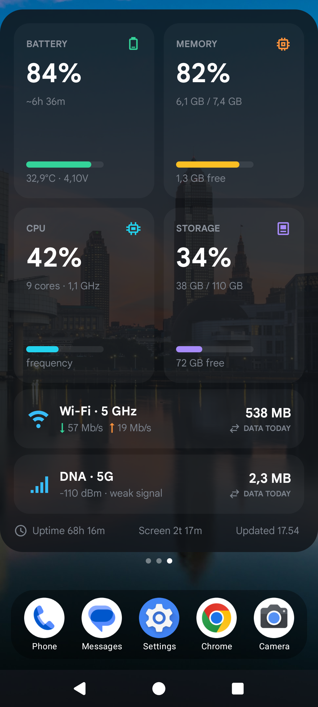
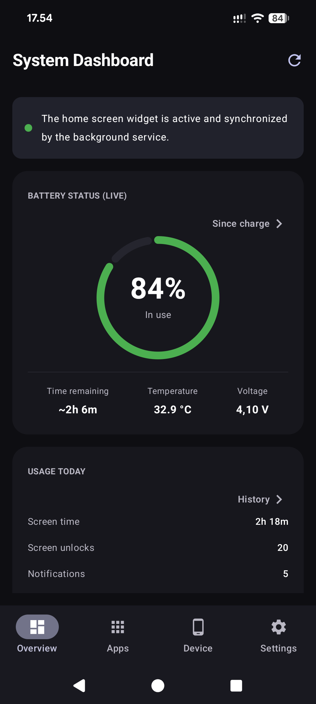
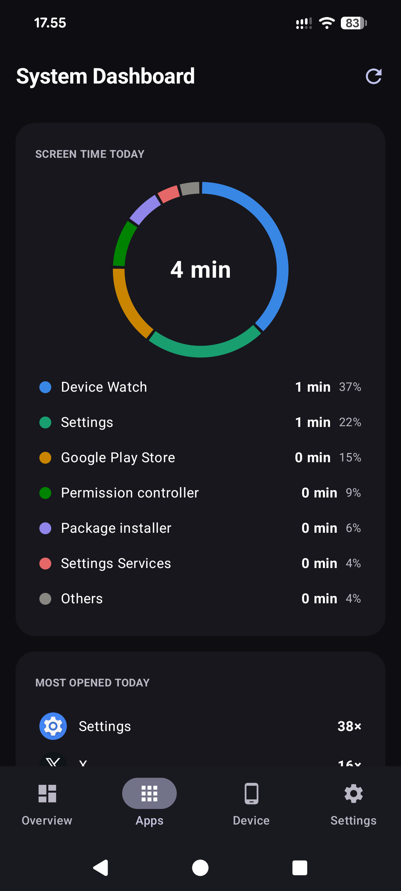
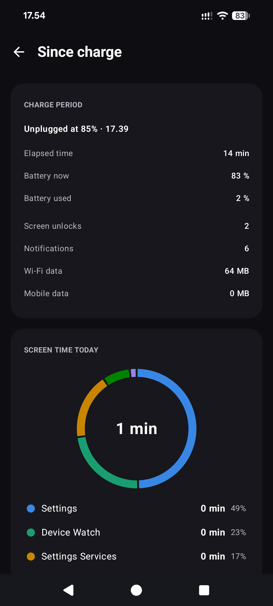
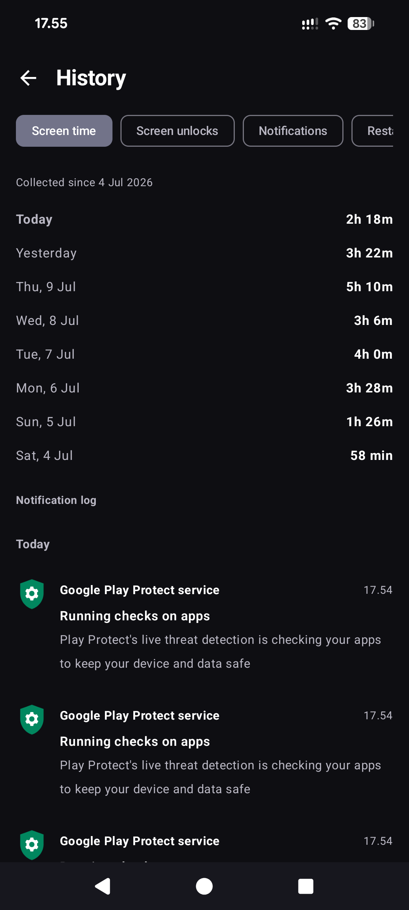
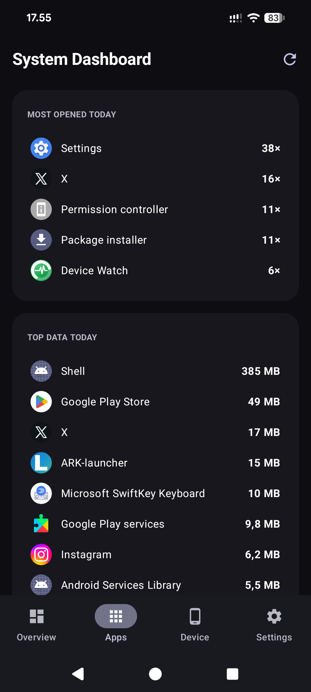
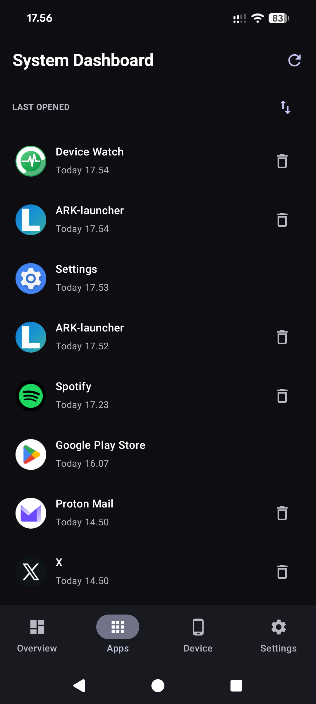
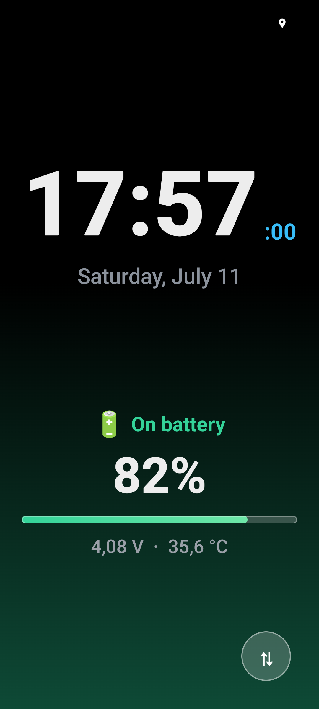

# Device Watch

[](https://github.com/jrs8205/Device-Watch/releases/latest)
[](https://f-droid.org/packages/org.jarsi.devicewatch)
[](https://device-watch.en.aptoide.com/app)
[](https://github.com/jrs8205/Device-Watch/releases)
[](https://developer.android.com/jetpack/compose)
[](LICENSE)

Device Watch is an Android device monitoring app with Jetpack Glance home screen widgets, per-app usage insights (screen time, data, notifications and more), and an interactive screensaver for charging or docked use.

The default app language is English. Finnish users get a localized app name and UI through Android's `values-fi` resources.

## Screenshots

<p>
  
  
  
  
</p>
<p>
  
  
  
  
</p>

## Features

- Home screen widget for battery, memory, CPU, storage, Wi-Fi, mobile network, data usage, uptime, today's screen time, and last update time
- Compact 2×2 widget for battery, uptime and mobile/Wi-Fi data, with the counting period shown above each data amount
- Widget background opacity slider, and a black-background switch for people whose other widgets are black
- Tapping the widget anywhere opens the app
- Data counters per calendar day or per one-month billing cycle with a configurable start day (month lengths handled automatically); the selection applies to the widget and the in-app data rows
- Tabbed dashboard UI with swipe navigation between tabs: Home (live battery ring, usage counters, data counters and RAM/CPU/storage meters — full widget parity for people who skip the widget), Apps (usage insights), Device (hardware, SIM and Wi-Fi details), and Settings
- First-run intro that walks through the widget, screensaver, counters and history, with guided permission setup explaining what each permission unlocks; replayable any time from Settings
- Pull-to-refresh on every page, and haptic feedback on buttons
- Apps tab: Digital-Wellbeing-style screen-time donut (top apps + others) with tappable legend, top data consumers today, and a last-opened list (oldest and never-used apps first, reversible) with per-app uninstall; home-screen launchers excluded from usage rankings
- Per-app detail sheet: screen time, times opened, last opened, data used and notifications today, plus the app's version, install and update dates, where it was installed from, the Android version it targets and needs, and which sensitive permissions it has been allowed (location, camera, microphone and so on), with a shortcut to its system settings
- Live traffic meter on the Home tab: download and upload right now, with the last minute drawn as a line; it reads the counters only while the page is on screen
- Camera details on the Device tab: each lens with its megapixels, aperture, 35 mm equivalent focal length and optical stabilisation, the zoom range, RAW and manual-control support and the Camera2 level
- Audio on the Device tab: connected headphones, Bluetooth and USB audio devices, built-in microphones and spatial audio
- Usage counters on the Home tab, scoped to the same day/billing-cycle setting as the data counters: total screen time, screen unlocks (API 28+), a filtered notification count (ongoing notifications, group summaries and updates to an existing notification are not counted, so the number stays believable), device restarts and charging sessions
- The app keeps its own 62-day daily history for these counters (Android has no retroactive API): unlocks and screen time are backfilled from the ~7 days Android remembers, restarts are derived from BOOT_COUNT deltas (immune to Android re-delivering BOOT_COMPLETED after app updates), and notification/charging tallies accumulate from install onward
- On-device notification log with app name, timestamp, title, and text; 7-day retention; tapping an entry opens the app that posted it (when still installed)
- History page (opened from the usage card) listing exact daily values for the retained 62 days — screen time, unlocks, notifications, device restarts, and charging sessions; each metric states since when it has been collected, and the page refreshes itself while open
- Charges on the History page: every charge in the retained 14 days of battery history, with its start and end level, duration, charging rate and peak battery temperature
- Used storage per day on the History page, with the change from the previous reading, and in the CSV and HTML exports
- Screen-on time alongside app screen time, collected by the monitor service even when the dashboard stays closed (Android 9+)
- Battery chart with 14 days of history, charging intervals and visible collection gaps
- Export usage history and the notification log as CSV, or share a self-contained HTML report with charts, daily and monthly tables, search and date filters
- Optional charging reminder at a chosen battery level from 50 to 95 %, and mobile-data quota alerts at 80 % and 100 % of the selected day or billing-cycle allowance
- Optional alerts, all off by default: a hot battery (45 °C), low storage (under 10 % free) and a fast-draining battery (20 % an hour or more); each comes once and again only after things have returned to normal
- Monthly data usage history on the History page: metered mobile and Wi-Fi totals per calendar month, served straight from Android's own statistics for up to 12 months back (no local storage needed)
- Since-charge page (opened from the battery card): the period since the battery was last charged full — or since the charger was unplugged, when charging stopped short of full — with elapsed time, battery drop and average drain, unlocks, notifications, Wi-Fi/mobile data, and a per-app screen-time donut over that window (Android does not expose real per-app battery percentages to third-party apps, so without extended access the page shows honest usage numbers instead)
- Optional extended access through [Shizuku](https://shizuku.rikka.app/) (no root needed) or root, both off by default, for what Android hides from ordinary apps: Android's own battery statistics on the since-charge page (drain per hour with the screen on and off and how long a full battery would last at that pace, each app's share, and what kept the phone awake, explained in plain words), the real processor load, graphics load, processor/graphics/surface temperatures, and the battery's wear, charge cycles and dates where the phone keeps them
- Today's screen time also appears in the widget footer, refreshed at most once a minute so the 5-second widget loop stays untouched
- Most-opened-today list on the Apps tab, and last-opened rows show the clock time for apps used today (following the system 12/24-hour setting) with two-tier staleness colors: amber after 1 month unused, red after 3 months (Google's app-hibernation threshold) or never used
- Special-access buttons show a green/red status dot for granted/missing access
- Active data-SIM carrier shown next to the mobile network name on dual-SIM devices
- Privacy dashboard shortcut for per-app location/microphone/camera usage (system view; that data is not exposed to third-party apps)
- Interactive Android screensaver with a large clock, date, next alarm, charging status, battery percentage, voltage, temperature, and live charging power in watts
- Screensaver clock follows the device 12/24-hour setting, with a second-aligned tick
- Battery-level-tinted background gradient and a softly pulsing charge indicator in the screensaver
- Optional screensaver dimming: manual, or automatic on a configurable night schedule (default 22:00–07:00)
- OLED burn-in protection: the screensaver content glides to a new spot within 15 dp once a minute
- Icons of unread notifications under the screensaver clock (one per app, with a count), pulsing when a new one arrives; needs notification access and can be turned off in Settings
- Remembered screensaver rotation setting for repeated charging sessions; the background gradient mirrors with the 180° layout swap
- Larger screensaver rotation touch target for easier use
- Battery full notification while the screensaver is active
- English default resources with Finnish localization
- Runtime permission handling for location, phone state, nearby Wi-Fi devices, and notifications
- Usage Access shortcut for network and app-usage statistics
- Release build configured with R8 minification and resource shrinking

Every metric is real data read from Android and kernel sources. When a value is not available with the permissions granted, the UI shows a dash (`—`) instead of a fabricated value.

Android backup and phone transfer carry user settings only. History, notification texts and delivered-alert flags stay on the device; a new phone can show its own first alerts. Exports leave the app only when you choose to share them.

## Download

[](https://f-droid.org/packages/org.jarsi.devicewatch)
[](https://aptoide-mmp.aptoide.com/api/v1/download?package_name=org.jarsi.devicewatch&oemid=584d342f9e68b0c33244b78f3cc21a24&redirect_url=https%3A%2F%2Fws.catappult.io%2Fapi%2FdirectToConsumer%2Forg.jarsi.devicewatch%2Fdownload)

Device Watch is available on
[**F-Droid**](https://f-droid.org/packages/org.jarsi.devicewatch), which also delivers updates
automatically, and on [**Aptoide**](https://device-watch.en.aptoide.com/app), which also offers a
[direct APK download](https://aptoide-mmp.aptoide.com/api/v1/download?package_name=org.jarsi.devicewatch&oemid=584d342f9e68b0c33244b78f3cc21a24&redirect_url=https%3A%2F%2Fws.catappult.io%2Fapi%2FdirectToConsumer%2Forg.jarsi.devicewatch%2Fdownload).
Alternatively, download the latest signed APK from the
[**Releases**](https://github.com/jrs8205/Device-Watch/releases/latest) page and open it on your
device to install. Releases are built reproducibly and F-Droid verifies each build against the
developer-signed APK, so every source ships an APK signed with the same key and later versions
install cleanly as an update over an existing one — from any source.

> **Upgrading from v1.3.1 or older:** the application ID changed in v1.4.0 from
> `com.example.modernwidget` to `org.jarsi.devicewatch`, so Android treats it as a new app.
> Install the new version, re-grant its permissions, re-add the widget and re-select the
> screensaver, then uninstall the old one. Collected usage history starts fresh.

Requires **Android 8.0 (API 26)** or newer.

## Troubleshooting

Common questions — the screensaver not starting, mobile data showing zero, notification counts,
history retention — are answered in the [FAQ](FAQ.md).

## Architecture

The app follows an MVVM + repository structure with Hilt dependency injection.

```
presentation/   DashboardViewModel, AppsViewModel, HistoryViewModel, SinceChargeViewModel
                and LiveTrafficViewModel (StateFlow UI state); CsvExporter,
                HtmlReportBuilder and PeriodComparison behind the History page
presentation/ui Compose-only screen code: SystemDashboardScreen scaffold with a
                Material 3 NavigationBar, Home/Apps/Device/Settings tabs, the
                History and Since-charge pages, the first-run intro, BatteryChart,
                LiveTrafficMeter and shared components (SettingsSectionCard,
                DeviceInfoRow, AppIcon, ScreenTimeDonut, AppDetailSheet, MetricText)
ui/theme/       The two looks (high-contrast and classic) as full Material 3 schemes
data/           SystemStatsRepository + AppUsageRepository (per-app usage, on demand)
                AppSettingsRepository (data-counter mode, cycle start day, alert switches)
                NotificationStats, UsageHistory, BatteryHistory (own tallies: 62-day
                daily history, 14-day battery log, charge sessions)
                SystemStatsParser, DataPeriodCalculator, UsageEventAggregator,
                NotificationCounting, ChargeSessions, AlertLogic, DataQuotaLogic,
                Camera/Audio/AppPackage logic (pure, unit-tested calculations)
                SystemStats / AppUsage / DeviceInfo models (+ UNAVAILABLE_* sentinels)
widget/         Glance DashboardWidget and CompactWidget, WidgetStateUpdater (DataStore
                writes), WidgetController (port the ViewModel talks to), receivers,
                actions and the font-scale cap (WidgetTextScale)
system/         SystemMonitorService (foreground) with the charge-limit, data-quota and
                health-alert notifiers, MonitorDreamService (screensaver) with
                DreamNotifications, NotificationCounterService (notification listener)
di/             Hilt modules and entry points
```

- `SystemStatsRepositoryImpl` is the single source of truth. It is a `@Singleton`, reads system/kernel sources off the main thread on an injected dispatcher, and serializes its CPU-load snapshots with a `Mutex`.
- `SystemDashboardScreen` observes the ViewModels with `collectAsStateWithLifecycle()` and obtains them via `hiltViewModel()`. The four tabs are pages of a `HorizontalPager` whose state is the single source of truth for the selected tab — swiping and the bottom bar both drive it (no navigation library); each page keeps its own scroll position. Permission requests and the foreground-service start stay at screen level.
- Services and the widget receiver use `@AndroidEntryPoint`; the Glance `ActionCallback` reaches the graph through a Hilt `EntryPoint`.

## Tech Stack

- Kotlin 2.4, AGP 9.2.1, Gradle 9.6
- `compileSdk 36`, `minSdk 26`, `targetSdk 35`
- Jetpack Compose (BOM 2026.06.00) + Material 3, Jetpack Glance 1.1.1
- Hilt 2.60 with KSP 2.3.9
- AndroidX Lifecycle 2.10, Activity 1.13, DataStore 1.2, WorkManager 2.11
- Dependencies are managed through the `gradle/libs.versions.toml` version catalog

## Language Behavior

Android selects the UI language from resource qualifiers:

- English and every non-Finnish device language use `app/src/main/res/values/strings.xml`
- Finnish devices use `app/src/main/res/values-fi/strings.xml`

## Permissions

The app requests only permissions that are used by the current feature set:

- `RECEIVE_BOOT_COMPLETED`
- `FOREGROUND_SERVICE`
- `FOREGROUND_SERVICE_SPECIAL_USE`
- `POST_NOTIFICATIONS`
- `ACCESS_NETWORK_STATE`
- `ACCESS_WIFI_STATE`
- `ACCESS_COARSE_LOCATION`
- `ACCESS_FINE_LOCATION`
- `NEARBY_WIFI_DEVICES`
- `READ_PHONE_STATE`
- `PACKAGE_USAGE_STATS`
- `QUERY_ALL_PACKAGES` (resolve names/icons for the per-app data list; the app is distributed outside Google Play)
- `REQUEST_DELETE_PACKAGES` (uninstall from the last-opened list via the system dialog)
- `USE_BIOMETRIC` (a normal permission, granted on install: only to show on the Device tab whether a strong biometric is enrolled — the app never authenticates anyone)
- `moe.shizuku.manager.permission.API_V23` (declared by the Shizuku library; it does nothing unless you install Shizuku yourself, switch Shizuku on in Settings and approve Device Watch in Shizuku's own dialog)

Root mode needs no permission: it is off by default, and the app starts `su` only after you switch it on and your root manager grants it.

Notification counting additionally uses the optional Notification access special permission (a `NotificationListenerService`); counting starts when access is granted. Do Not Disturb and Bluetooth control permissions are not requested.

## Building

Use the Gradle wrapper from the repository root:

```powershell
.\gradlew.bat :app:compileDebugKotlin
.\gradlew.bat :app:testDebugUnitTest
.\gradlew.bat :app:lintDebug
.\gradlew.bat :app:assembleDebug
.\gradlew.bat :app:assembleRelease
```

Release builds are minified with R8 and resource shrinking. The release APK is unsigned unless a local `keystore.properties` and keystore are present.

## Testing

648 JVM unit tests (JUnit 4 + Truth; Robolectric only for the Glance render, backup-rule and
settings-store tests) cover the pure logic behind every screen, service and widget:

```powershell
.\gradlew.bat :app:testDebugUnitTest
```

- **Parsing and maths** — `SystemStatsParserTest`, `CpuWindowTest`, `DataPeriodCalculatorTest`,
  `UsageEventAggregatorTest`, `ExtraStatsLogicTest`, `AppPackageLogicTest`, `CameraLogicTest`,
  `AudioLogicTest`, `TrafficMeterTest`
- **Extended access (Shizuku and root)** — `ShellSessionTest` (the shell conversation, driven
  through a real `sh`; on Windows through Git's), `PrivilegedShellTest`,
  `BatteryStatsDumpParserTest`, `PrivilegedDumpParsersTest` (parsers written against dumps from
  real phones)
- **Own history and stores** — `UsageHistoryLogicTest`, `UsageHistoryImplTest`,
  `NotificationCountingTest`, `NotificationLogCodecTest`, `NotificationLogImplTest`,
  `BatteryHistoryCodecTest`, `BatteryHistoryImplTest`, `ChargeSessionsTest`,
  `ChargeAnchorLogicTest`, `AppSettingsRepositoryImplTest`, `DeviceLocalFlagsTest`,
  `AlertStateBackupTest`, `BackupRulesTest`
- **Alerts and notifications** — `AlertLogicTest`, `DataQuotaLogicTest`,
  `DataQuotaSettingsChangeTest`, `ChargeLimitLogicTest`, `HealthAlertControllerTest`,
  `NotificationDeliveryTest`
- **ViewModels and exports** — `DashboardViewModelTest`, `AppsViewModelTest`,
  `HistoryViewModelTest`, `SinceChargeViewModelTest`, `LiveTrafficViewModelTest`,
  `PeriodComparisonTest`, `CsvExporterTest`, `HtmlReportBuilderTest`, `ReportPaletteTest`
  (hand-written fakes in `Fakes.kt`)
- **UI logic** — `HistoryListLogicTest`, `SinceChargeNoticesTest`, `BatteryChartLogicTest`,
  `LabelValueRowTest`, `AppScaleTest`, `AppPaletteTest` (the WCAG AAA contrast of both looks)
- **Widgets** — `WidgetFormattingTest`, `WidgetTextScaleTest`, `CompactFitTest`,
  `CompactUptimeTest`, `CompactWidgetRenderTest`
- **Screensaver** — `ClockFitTest`, `DreamLogicTest` (night-dim window, charging watts),
  `DreamNotificationLogicTest` (which notifications show, grouping, arrivals, row fit),
  `ActiveNotificationsStoreTest`

## Build Outputs

```text
app/build/outputs/apk/debug/app-debug.apk
app/build/outputs/apk/release/app-release.apk
```

APK and signing files are intentionally ignored by Git.

## Project Structure

```text
app/src/main/java/org/jarsi/devicewatch/
  MainActivity.kt
  MonitorApp.kt
  data/
    AlertLogic.kt
    AppPackageLogic.kt
    AppSettingsRepository.kt
    AppSettingsRepositoryImpl.kt
    AppUsage.kt
    AppUsageRepository.kt
    AppUsageRepositoryImpl.kt
    AudioLogic.kt
    BatteryHistory.kt
    BatteryHistoryImpl.kt
    BatteryStatusReader.kt
    BatteryUsage.kt
    CameraLogic.kt
    ChargeAnchor.kt
    ChargeAnchorStoreImpl.kt
    ChargeSessions.kt
    DataPeriod.kt
    DataQuotaLogic.kt
    DeviceInfo.kt
    DeviceLocalFlags.kt
    DeviceState.kt
    ExtraStatsLogic.kt
    NotificationCounting.kt
    NotificationLog.kt
    NotificationLogImpl.kt
    NotificationStats.kt
    NotificationStatsImpl.kt
    PrivilegedDumpParsers.kt
    PrivilegedShell.kt
    RootShell.kt
    ShellBatteryUsageSource.kt
    ShellUserService.kt
    ShizukuShell.kt
    SystemStats.kt
    SystemStatsParser.kt
    SystemStatsRepository.kt
    SystemStatsRepositoryImpl.kt
    TrafficMeter.kt
    UsageEventAggregator.kt
    UsageHistory.kt
    UsageHistoryImpl.kt
  di/
    DispatchersModule.kt
    RepositoryEntryPoint.kt
    RepositoryModule.kt
  presentation/
    AppsViewModel.kt
    CsvExporter.kt
    DashboardViewModel.kt
    HistoryCoverage.kt
    HistoryViewModel.kt
    HtmlReportBuilder.kt
    LiveTrafficViewModel.kt
    PeriodComparison.kt
    SinceChargeViewModel.kt
    ui/
      AppDetailSheet.kt
      AppScale.kt
      AppsTab.kt
      BatteryChart.kt
      BatteryChartLogic.kt
      BatteryUsageCards.kt
      DashboardComponents.kt
      DashboardTabs.kt
      DeviceTab.kt
      Haptics.kt
      HistoryListLogic.kt
      HistoryPage.kt
      LiveTrafficMeter.kt
      MetricText.kt
      OnboardingPage.kt
      OverviewTab.kt
      ScreenTimeDonut.kt
      SettingsTab.kt
      SinceChargeNotices.kt
      SinceChargePage.kt
  system/
    AlertNotifications.kt
    BatteryFullNotifier.kt
    ChargeLimitLogic.kt
    ChargeLimitNotifier.kt
    DataQuotaNotifier.kt
    DreamNotifications.kt
    DreamPreferences.kt
    HealthAlertController.kt
    HealthAlertNotifier.kt
    MonitorDreamService.kt
    MonitorServiceRelay.kt
    NotificationCounterService.kt
    NotificationDelivery.kt
    SystemMonitorService.kt
  ui/
    theme/
      Color.kt
      Theme.kt
  widget/
    CompactWidget.kt
    DashboardWidget.kt
    DashboardWidgetReceiver.kt
    RefreshStatsAction.kt
    WidgetController.kt
    WidgetStateUpdater.kt
    WidgetTextScale.kt

app/src/test/java/org/jarsi/devicewatch/
  data/
    AlertLogicTest.kt
    AlertStateBackupTest.kt
    AppPackageLogicTest.kt
    AppSettingsRepositoryImplTest.kt
    AudioLogicTest.kt
    BackupRulesTest.kt
    BatteryHistoryCodecTest.kt
    BatteryHistoryImplTest.kt
    BatteryStatsDumpParserTest.kt
    CameraLogicTest.kt
    ChargeAnchorLogicTest.kt
    ChargeSessionsTest.kt
    CpuWindowTest.kt
    DataPeriodCalculatorTest.kt
    DataQuotaLogicTest.kt
    DeviceLocalFlagsTest.kt
    ExtraStatsLogicTest.kt
    NotificationCountingTest.kt
    NotificationLogCodecTest.kt
    NotificationLogImplTest.kt
    PrivilegedDumpParsersTest.kt
    PrivilegedShellTest.kt
    ShellSessionTest.kt
    SystemStatsParserTest.kt
    TrafficMeterTest.kt
    UsageEventAggregatorTest.kt
    UsageHistoryImplTest.kt
    UsageHistoryLogicTest.kt
  presentation/
    AppsViewModelTest.kt
    CsvExporterTest.kt
    DashboardViewModelTest.kt
    Fakes.kt
    HistoryViewModelTest.kt
    HtmlReportBuilderTest.kt
    LiveTrafficViewModelTest.kt
    PeriodComparisonTest.kt
    ReportPaletteTest.kt
    SinceChargeViewModelTest.kt
    ui/
      AppScaleTest.kt
      BatteryChartLogicTest.kt
      HistoryListLogicTest.kt
      LabelValueRowTest.kt
      SinceChargeNoticesTest.kt
  system/
    ActiveNotificationsStoreTest.kt
    ChargeLimitLogicTest.kt
    ClockFitTest.kt
    DataQuotaSettingsChangeTest.kt
    DreamLogicTest.kt
    DreamNotificationLogicTest.kt
    HealthAlertControllerTest.kt
    NotificationDeliveryTest.kt
  ui/
    theme/
      AppPaletteTest.kt
  widget/
    CompactFitTest.kt
    CompactUptimeTest.kt
    CompactWidgetRenderTest.kt
    WidgetFormattingTest.kt
    WidgetTextScaleTest.kt
```

## License

Device Watch is free software, licensed under the GNU General Public License,
version 3 of the License, or (at your option) any later version
(SPDX: `GPL-3.0-or-later`). See [LICENSE](LICENSE) for the full text.
